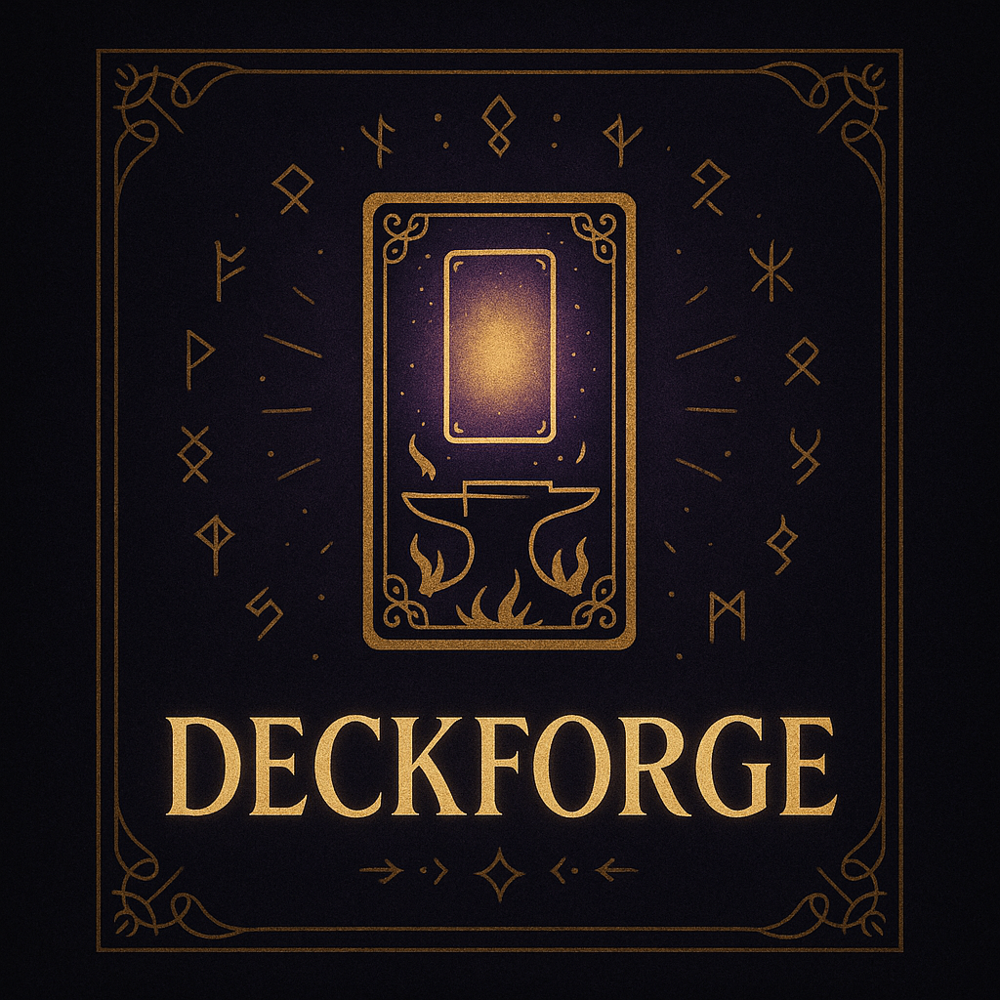

# DeckForge
Deckforge serves as the blockchain/API component of a privately hosted trading cards / NFT project.

It was developed as part of a personal project to release a biographical set of trading cards for my friends and family without the need to pay pubnet gas fees when transacting.

## Development Status
This project is currently in **initial development**. While the core functionality is in place, additional features, optimizations, and improvements are being worked on. Contributions, feedback, and suggestions are welcome!

## Important!
This project does not assert 'Smart Contracts', and the single blockchain node is not decentralized. As such, this is obviously unsuitable to serve as the foundation of any serious NFT project requiring public trust.

## License
This project is dual-licensed under the GNU Affero General Public License v3 (AGPLv3) and a commercial license. You may use, modify, and distribute the software under the terms of the AGPLv3, which requires sharing source code for network-accessible applications.

If you prefer to use this software under different terms—for example, in proprietary or commercial products - a commercial license is available. For details, see the [LICENSE.txt](LICENSE.txt) file in the repository.